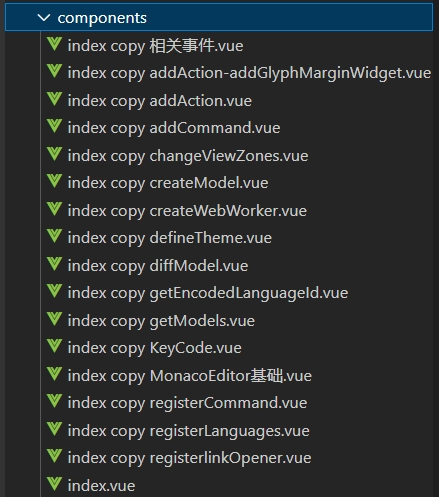

# Monaco Editor 译文

## 介绍

本文是对 [Monaco Editor](https://github.com/Microsoft/monaco-editor) 的中文翻译，旨在帮助开发者更好的使用 Monaco Editor。共计 500+ 篇文章，采用 VitePress 构建，支持代码高亮、目录、搜索等功能。

感谢大家的支持，望多多 start ~ 🙏🙏🙏

## 地址

中文学习地址：[Monaco Editor Translate](https://wf0.github.io/)

网站采用 github pages 构建，可能网站响应较慢，请耐心等待。

## 特性

- 贴合官网：采用原生目录接口进行编写，保持与官网一致的目录结构；
- API示例：特定API还增加样例及截图，使得用户更清晰了解API的使用；
- 版本最新：翻译目前最新版本 `V0.49.0`；
- 附加DEMO：针对难点，书写了相关DEMO，使得更快了解其含义。

## 相关截图

## Monaco Editor 共创计划

1. github地址：https://github.com/wf0/monaco-editor-translate
2. gitee地主：https://gitee.com/wfeng0/monaco-editor-translate
3. 如果发现文档存在错误，欢迎提交 PR 或 Issue
4. 欢迎加入QQ群，一起交流