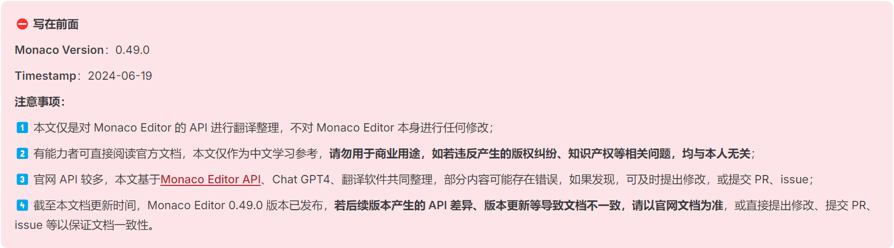
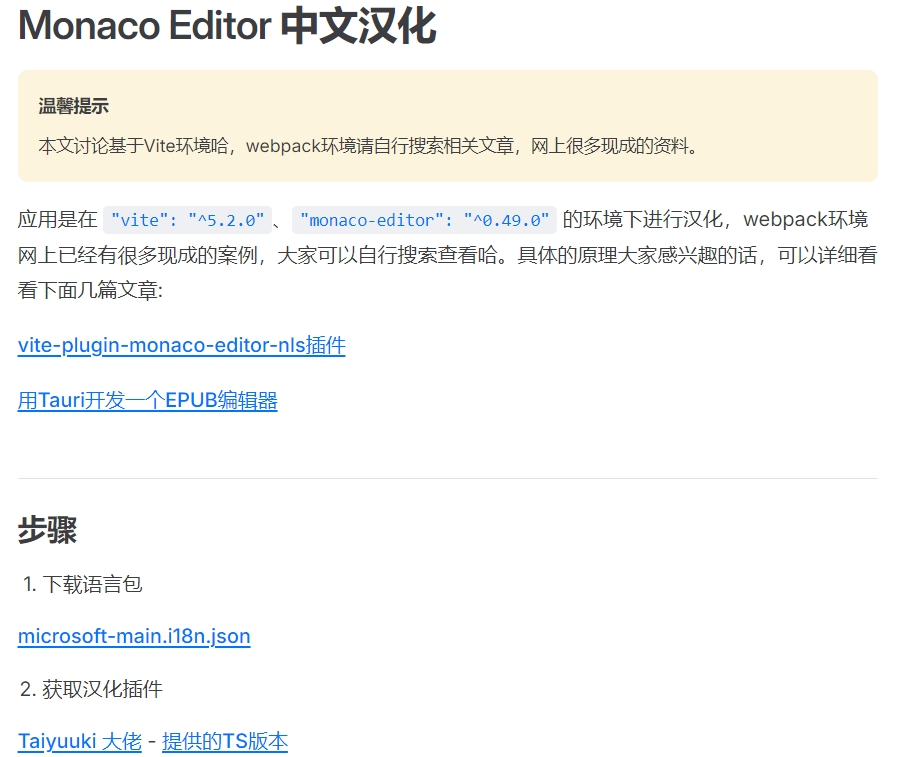
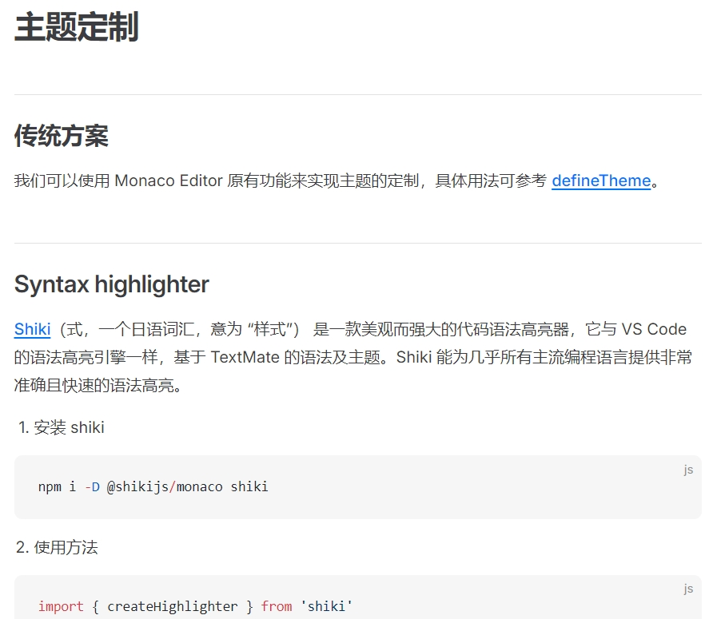
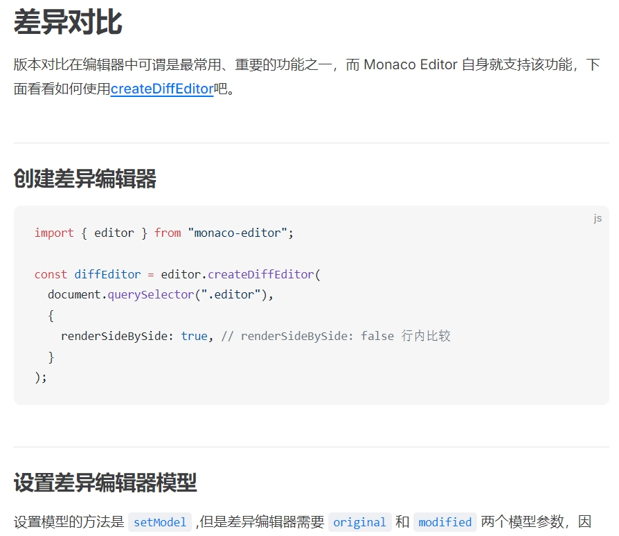

# Monaco Editor Translate 项目介绍

## 前言

地址：[https://wf0.github.io/](https://wf0.github.io/) ，网站采用 github pages 构建，可能响应较慢，请耐心等待。感谢大家的支持，望多多 start ~ 🙏🙏🙏

## 特性

- **版本最新**：翻译目前最新版本 `V0.49.0`；
- **文档全面**：全文共计`500+`篇文章，涵盖全部API、接口、类；
- **贴合官网**：采用原生目录接口进行编写，保持与官网一致的菜单结构；
- **附加示例**：特定API还增加样例及截图，使得用户更清晰了解API的使用；
- **应用DEMO**：提供一些应用示例、使用场景、常见功能DEMO，帮助用户快速了解 Monaco Editor 的适用范围、功能；

## 相关截图

<!-- 应用示例 -->
**应用示例:**

## Monaco Editor 共创计划

1. github地址：https://github.com/wf0/monaco-editor-translate
2. gitee地址：https://gitee.com/wfeng0/monaco-editor-translate
3. 如果发现文档存在错误，欢迎提交 PR 或 Issue，亦或直接点击页面 `在 GitHub 上编辑此页面` ，前往提交。
4. 欢迎加入讨论群，一起交流相关技术(借用 socketIO 的交流群哈`522121825`)。

## 未来计划

1. 针对每一个API，增加示例及截图，对不同的类、方法、属性进行更加详细的描述；
2. 完善应用章节，方便用户快速了解如何 Monaco Editor 可能的应用场景。
3. 持续更新，持续翻译，持续维护。