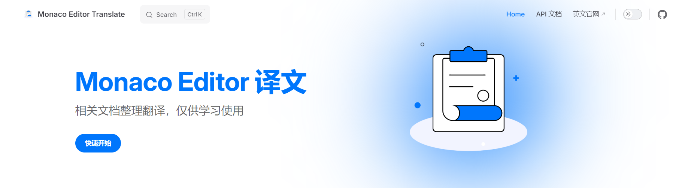
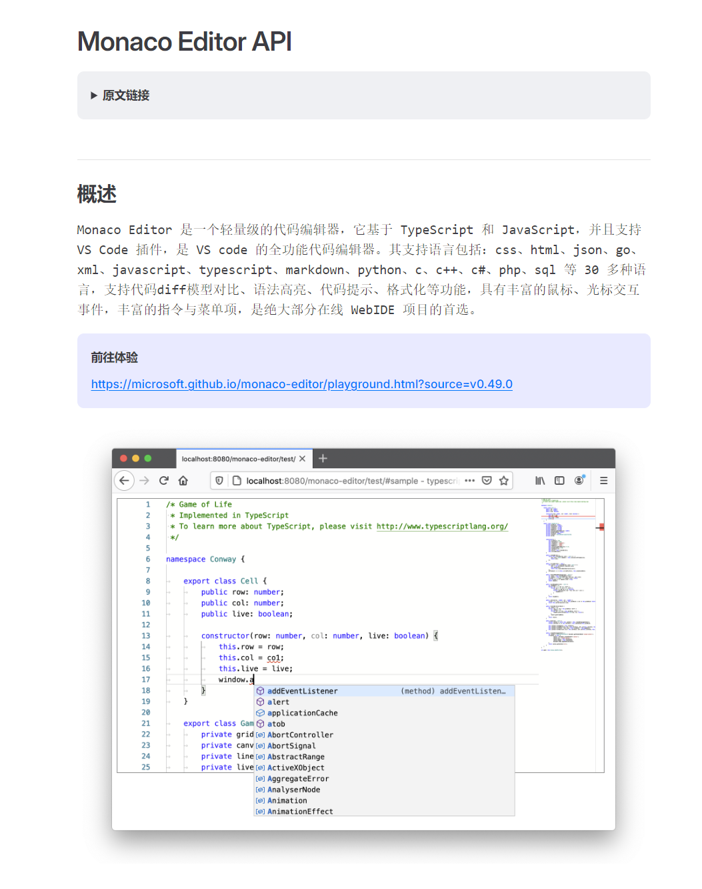
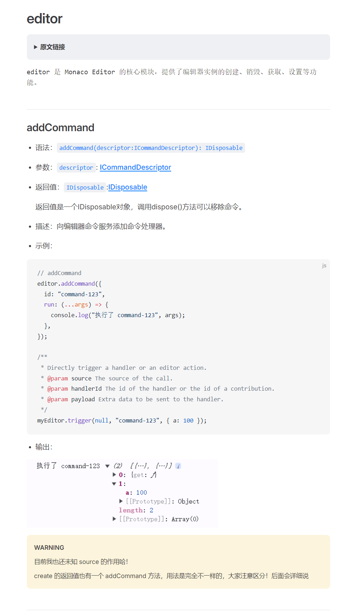
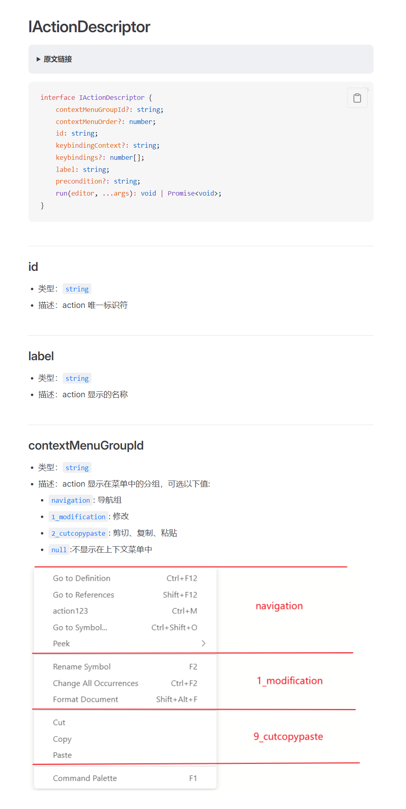

# Monaco Editor 译文

## 地址
中文学习地址：[Monaco Editor Translate](https://wf0.github.io/)

## 特性

- 贴合官网：采用原生目录接口进行编写，保持与官网一致的目录结构；
- 携带示例：特定API还增加样例及截图，使得用户更清晰了解API的使用；
- 版本最新：翻译目前最新版本 `V0.49.0`；

## 相关截图

## Monaco Editor 共创计划
1. github地址：[Monaco Editor Translate](https://github.com/wf0/monaco-editor-translate)
2. 如果发现文档存在错误，欢迎提交 PR 或 Issue
3. 欢迎加入QQ群，一起交流